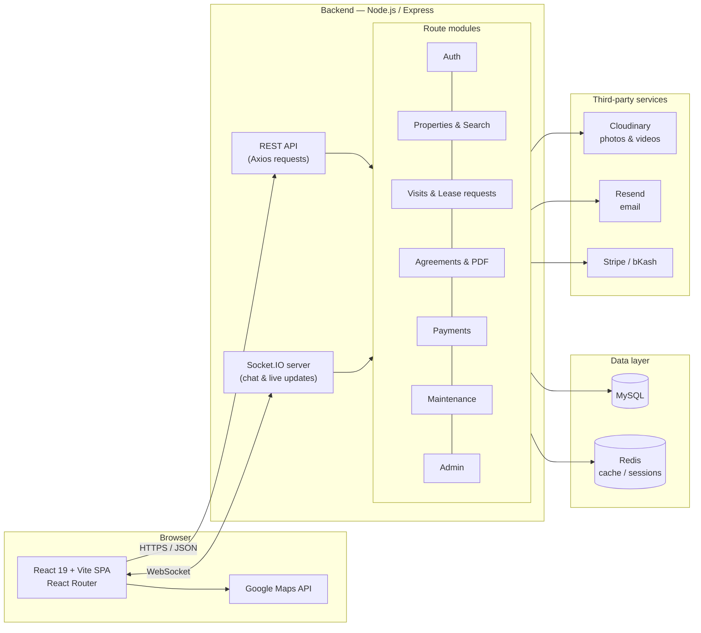
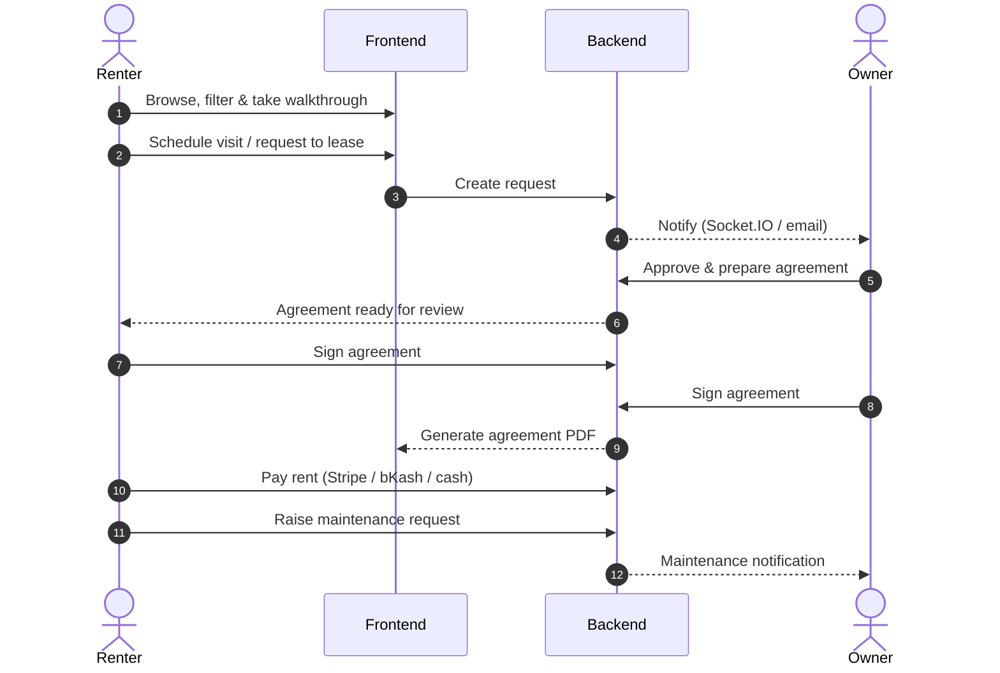

# Housy

Housy is a full-stack rental property platform that connects renters and property owners in one place. It supports property discovery, interactive walkthroughs, lease requests, real-time communication, digital rental agreements, payments, maintenance requests, and account management.

<!-- Optional: record a short screen capture of the app and drop it here -->
<!-- <p align="center"></p> -->

## Contents

- [Features](#features)
- [Architecture](#architecture)
- [Technology stack](#technology-stack)
- [Project structure](#project-structure)
- [Getting started](#prerequisites)
- [Environment configuration](#environment-configuration)
- [Security notes](#security-notes)

## Features

### For renters

- Browse and search available rental properties
- Filter properties by price, type, bedrooms, bathrooms, and amenities
- Explore properties through interactive photo walkthroughs
- View optional video walkthroughs and room markers
- Schedule property visits
- Send requests to lease
- Chat with property owners
- Review and sign rental agreements
- View current residency and requested-property information
- Manage profile details and profile picture
- Track payments and maintenance requests

### For property owners

- Create and manage property listings
- Upload and arrange interactive walkthrough photos
- Upload video walkthroughs and add timed room markers
- Review visit schedules and lease requests
- Communicate with prospective and current renters
- Prepare, review, and sign rental agreements
- Generate downloadable agreement PDFs
- Manage leases, payments, and maintenance requests
- Manage account details and profile picture

### Administration

- Role-based access for renters, owners, and administrators
- Property and account verification workflows
- Platform activity and rental-management tools

## Architecture

### System overview



### Rental lifecycle



## Technology stack

| Area | Technology |
| --- | --- |
| Frontend | React 19, Vite, React Router, Axios |
| UI utilities | React Hot Toast, React Signature Canvas, Google Maps API |
| Backend | Node.js, Express |
| Database | MySQL |
| Real-time features | Socket.IO |
| Caching/session support | Redis |
| Media storage | Cloudinary |
| Email | Resend |
| Payments | Stripe, bKash, and cash-payment workflows |
| Documents | Server-generated rental agreement PDFs |

## Project structure

```text
Housy/
├── Backend/       # Express API, database schema, migrations, and services
├── Frontend/      # React and Vite web application
├── image/         # Project images and supporting visual assets
├── .gitignore
└── README.md
```

## Prerequisites

Install the following before running the project:

- Node.js 18 or newer
- npm
- MySQL 8 or a compatible MySQL/MariaDB installation
- Redis or a compatible hosted Redis service
- A Cloudinary account for uploaded media

Some features also require credentials for services such as Resend, Google Maps, Stripe, or bKash.

## Installation

### 1. Clone the repository

```bash
git clone https://github.com/MashkwatOme/Housy.git
cd Housy
```

### 2. Configure the backend

```bash
cd Backend
npm install
```

Create a local environment file from the supplied example:

**Windows PowerShell**

```powershell
Copy-Item .env.example .env
```

**macOS or Linux**

```bash
cp .env.example .env
```

Open `Backend/.env` and enter the database and service credentials required by your installation. Never commit this file.

### 3. Create the database

1. Create an empty MySQL database for Housy.
2. Import `Backend/src/schema.sql`.
3. If your copy includes additional files in `Backend/src/migrations/`, apply them in their intended order.
4. Ensure the database values in `Backend/.env` match the database you created.

For example, using the MySQL command line:

```bash
mysql -u YOUR_MYSQL_USER -p YOUR_DATABASE_NAME < Backend/src/schema.sql
```

Run this command from the repository root and replace the placeholder values with your own.

### 4. Start the backend

From the `Backend` directory, use the development script defined in its `package.json`:

```bash
npm run dev
```

If no development script is configured in your local version, use:

```bash
npm start
```

### 5. Configure and start the frontend

Open a second terminal:

```bash
cd Housy/Frontend
npm install
npm run dev
```

Vite will display the local frontend address in the terminal. It is normally:

```text
http://localhost:5173
```

Keep both the frontend and backend terminals running while using the application.

## Environment configuration

Use `Backend/.env.example` as the source of truth for supported backend variables. Depending on the enabled features, the configuration generally covers:

- Server port and frontend URL
- MySQL connection
- Authentication secrets
- Redis connection
- Cloudinary media storage
- Resend email delivery
- Google services
- Stripe and bKash payment settings

Do not place real passwords, API keys, tokens, or private credentials in this README or commit them to Git.

## Database changes

The base database structure is stored in `Backend/src/schema.sql`. Incremental changes are stored in `Backend/src/migrations/`, including changes for interactive walkthroughs, profiles, and maintenance functionality.

When deploying an update, back up the database before applying a migration.

## Security notes

- Keep all `.env` files private.
- Do not commit `node_modules/`, build output, logs, or editor-specific files.
- Use strong authentication and database secrets in production.
- Restrict production CORS origins to the deployed frontend.
- Validate payment and webhook credentials separately for test and live environments.
- Review the generated rental agreement with qualified legal counsel before relying on it for registration, dispute resolution, or court proceedings.

## Build the frontend for production

```bash
cd Frontend
npm run build
```

The production output is generated in `Frontend/dist/`.

## Contributing

1. Create a new branch from `main`.
2. Make and test your changes.
3. Commit with a clear message.
4. Push the branch to GitHub.
5. Open a pull request for review.

## Repository

[github.com/MashkwatOme/Housy](https://github.com/MashkwatOme/Housy)

## License

No open-source license has been specified for this project. Unless a license is added, all rights are reserved by the project owner.
## Frontend

The Housy frontend is built with React and provides interfaces for property browsing, tenant dashboards, owner management, scheduling, payments, and communication.
